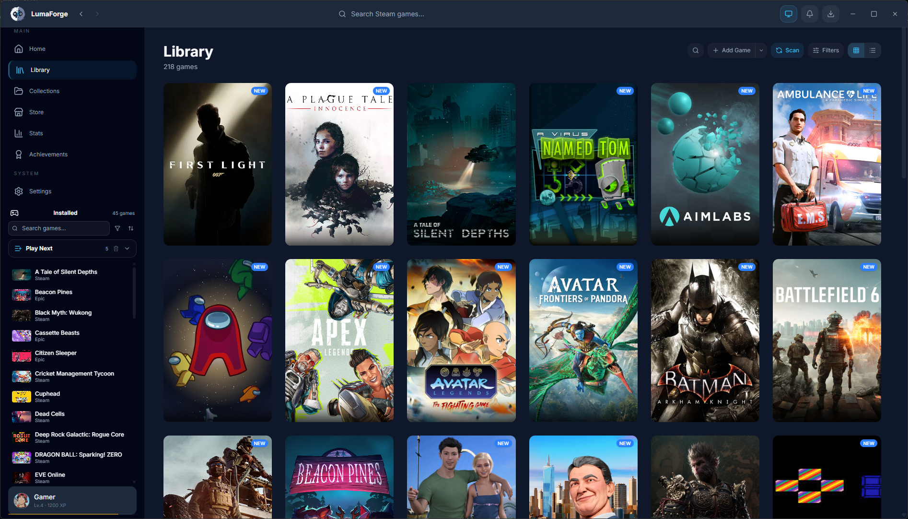
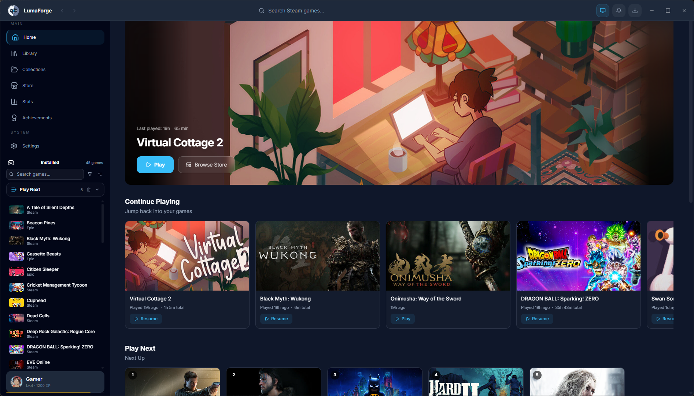
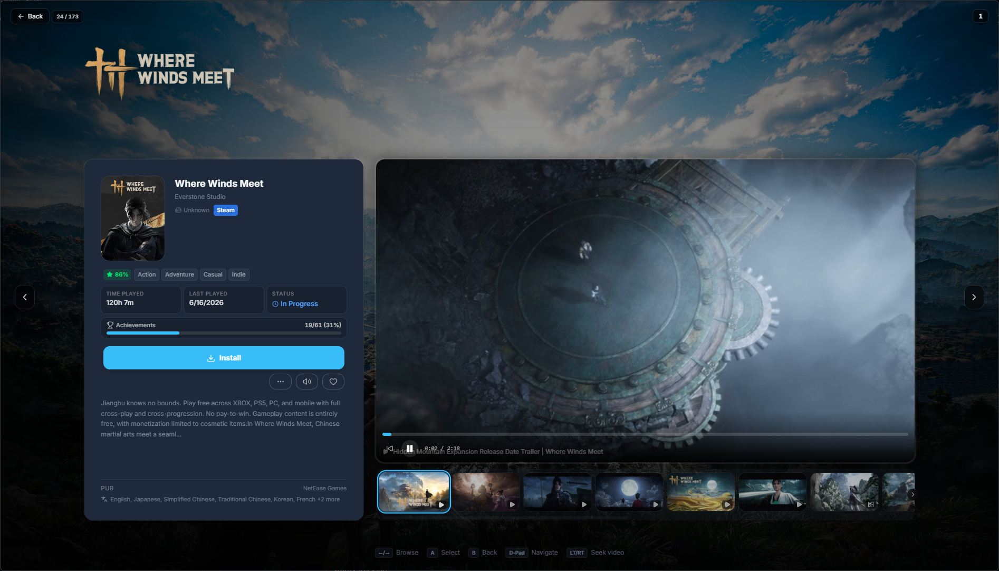
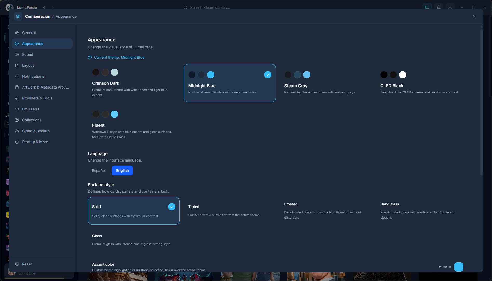

<div align="center">

# LumaForge

**Gestor de biblioteca de juegos de escritorio open-source con Steam, Epic, emuladores, extensiones Lua, debrid/torrents y mas.**


[English](README.md) · [Espanol](README.es.md)

</div>

---

## Descargo de Responsabilidad

LumaForge es un **proyecto educativo** y una **demostracion tecnica** del desarrollo de aplicaciones de escritorio modernas utilizando Tauri v2, Rust, React y TypeScript. Esta disenado para mostrar patrones avanzados de arquitectura de software, incluyendo sistemas de plugins, integracion de scripting Lua, deteccion de juegos multi-proveedor, colas de trabajo en segundo plano y cache respaldada por SQLite.

**LumaForge no esta afiliado, respaldado ni conectado con Valve Corporation, Steam, Epic Games, ni ninguna distribuidora de juegos.** Todas las marcas registradas pertenecen a sus respectivos propietarios.

Este software se proporciona estrictamente con fines educativos y de demostracion. Los usuarios son responsables de garantizar el cumplimiento de todas las leyes aplicables y los terminos de servicio de las plataformas y juegos con los que interactuen a traves de este software.

---

## Capturas de Pantalla

> Proximamente. Coloca tus imagenes en `docs/screenshots/` para completar esta seccion.

| | |
|:---:|:---:|
|  |  |
| **Biblioteca Unificada** | **Panel Inteligente** |
|  |  |
| **Modo Consola** | **Ajustes y Herramientas** |

---

## Caracteristicas

| Caracteristica | Descripcion |
|----------------|-------------|
| **Biblioteca Multi-Proveedor** | Biblioteca unificada de juegos de Steam, Epic Games, 46+ emuladores, scripts Lua y entradas manuales |
| **Lanzamiento Nativo** | Lanzamiento directo de juegos de Steam y Epic con seguimiento de procesos y grabacion de tiempo de juego |
| **Integracion de Emuladores** | 46+ emuladores con deteccion automatica de ROMs, insignias de plataforma, metadatos de IGDB y seleccion de perfil por juego |
| **Epic Games Store** | Deteccion completa de la biblioteca de Epic, lanzamiento por protocolo, gestion de tokens y seguimiento de instalacion |
| **Debrid/Torrent** | Descarga e instala juegos a traves de proveedores debrid (TorBox, Real-Debrid, AllDebrid, Premiumize) o cliente torrent integrado (librqbit) |
| **Seguimiento de Logros** | Monitoreo en tiempo real de logros con notificaciones de desbloqueo, seguimiento de progreso y soporte multi-proveedor |
| **Steam Keys** | Integracion con SteamCMD con pin/unpin de versiones de manifiesto, generacion de claves Lua y busqueda de depot keys |
| **Redireccion en la Nube** | Redireccion de guardado en la nube basada en proveedor con OAuth, soporte de variantes y advertencias de reinicio |
| **Colecciones** | Colecciones anidadas con drag-and-drop, encabezados de panel y menus contextuales |
| **Jugar Siguiente** | Cola inteligente con puntuacion por backend, tarjeta en la barra lateral y seccion del panel |
| **Modo Consola** | Interfaz navegable con gamepad a pantalla completa inspirada en Steam Big Picture y Solaris |
| **Correcciones de Juegos** | Aplicacion con un clic de SmokeAPI, Steamless, Goldberg Emulator, Online-Fix y Koaloader |
| **Gestion de Medios** | Resolucion automatica de arte de Steam, SteamGridDB, IGDB y RAWG con cadenas de prioridad |
| **Panel Inteligente** | Pantalla de inicio personalizada con Jugar Continuar, Favoritos, Recomendaciones y secciones de descubrimiento |
| **Sistema de Extensiones** | Runtime Lua 5.4 en sandbox con API `lumaforge.*`, evaluador de criterios y registro de herramientas de terceros |
| **Fondos Ambientales** | Fondos dinamicos con arte del juego, modo de imagen, modo color dominante, transiciones de fundido y niveles de intensidad |
| **Gestor Universal de Descargas** | Cola unificada para instalaciones de Steam, descargas debrid y transferencias torrent con graficos de velocidad en vivo |
| **Almacenamiento SQLite-First** | Todos los datos del juego, tiempo de juego, logros y configuracion persistidos en SQLite con migracion JSON |
| **Actualizaciones Automaticas** | Actualizador integrado con instalador NSIS firmado y verificacion automatica de actualizaciones |

---

## Stack Tecnologico

| Capa | Tecnologia |
|------|-----------|
| **Backend** | Rust (Tauri v2) |
| **Frontend** | React 19 + TypeScript 5.8 + Vite 8.2 |
| **Base de Datos** | SQLite (via rusqlite) |
| **Bundler** | Rolldown (Vite 8.2) |
| **Motor Torrent** | librqbit 8.x (vendido) |
| **Runtime Lua** | mlua 0.10 (Lua 5.4, vendido) |
| **Estilos** | Tailwind CSS 4.3 |
| **Instalador** | NSIS (nativo de Tauri v2) con arte personalizado |

---

## Primeros Pasos

### Requisitos

- **Rust** 1.77+ (con `cargo`)
- **Node.js** 20.19+ o 22.12+
- **npm**
- **WebView2** (incluido con Windows 10/11)

### Desarrollo

```bash
git clone https://github.com/eisora08/lumaforge.git
cd lumaforge
npm install
npm run tauri dev
```

### Compilar

```bash
npm run tauri build
```

El instalador estara en `src-tauri/target/release/bundle/nsis/`.

---

## Estructura del Proyecto

```
LumaForge/
├── src/                          # Frontend (React + TypeScript)
│   ├── components/               # Componentes UI (dashboard, library, store, settings, console)
│   ├── context/                  # Contextos React (GameSession, Library, Favorites, Settings)
│   ├── hooks/                    # Hooks personalizados (playtime, media, deteccion de control)
│   ├── services/                 # Logica de negocio (game cache, achievements, debrid, metadata, epic)
│   ├── features/                 # Modulos de funciones (modo consola, perfil, debrid, DRM, emuladores)
│   ├── pages/                    # Paginas de rutas (Home, Library, Store, Settings, Downloads)
│   └── types/                    # Definiciones de tipos TypeScript
├── src-tauri/                    # Backend (Rust + Tauri v2)
│   ├── src/
│   │   ├── commands/             # Manejadores de comandos Tauri (40+ modulos)
│   │   ├── models/               # Modelos de datos y structs
│   │   ├── sqlite_cache/         # Esquema SQLite, migraciones y consultas
│   │   ├── utils/                # Funciones de utilidad (progreso, descarga, extraccion)
│   │   └── lua_engine/           # Runtime Lua 5.4 en sandbox
│   ├── nsis/                     # Arte del instalador NSIS (archivos BMP)
│   └── tauri.conf.json           # Configuracion de Tauri
├── tools/                        # Herramientas de compilacion y generadores de catalogo
├── public/                       # Estaticos (catalogos de datos, indices DRM)
├── docs/screenshots/             # Capturas de pantalla para README
└── lumaforge-extensions/         # Manifiestos de extensiones integradas
```

---

## Licencia

Este proyecto esta licenciado bajo la **GNU General Public License v3.0** — ver el archivo [LICENSE](LICENSE) para mas detalles.

Las dependencias de terceros y sus licencias se enumeran en [THIRD_PARTY_NOTICES.md](THIRD_PARTY_NOTICES.md).
